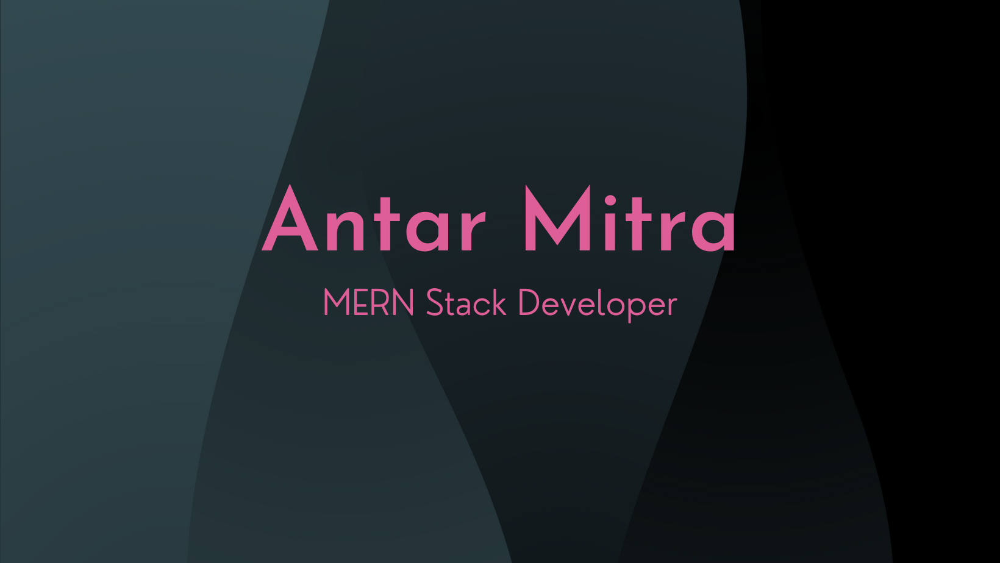

### Hi there 👋, I am Antar Mitra, Nice to meet you.

I am a MERN Stack Developer. Web Development is my passion. Love to learn new skills. Full and Fresh hand code is my power.Always eager to learn and take on new challenges.

## Contact

## Skills and Tools

<!--
**antarmitra/antarmitra** is a ✨ _special_ ✨ repository because its `README.md` (this file) appears on your GitHub profile.

Here are some ideas to get you started:

- 🔭 I’m currently working on ...
- 🌱 I’m currently learning ...
- 👯 I’m looking to collaborate on ...
- 🤔 I’m looking for help with ...
- 💬 Ask me about ...
- 📫 How to reach me: ...
- 😄 Pronouns: ...
- ⚡ Fun fact: ...
-->
